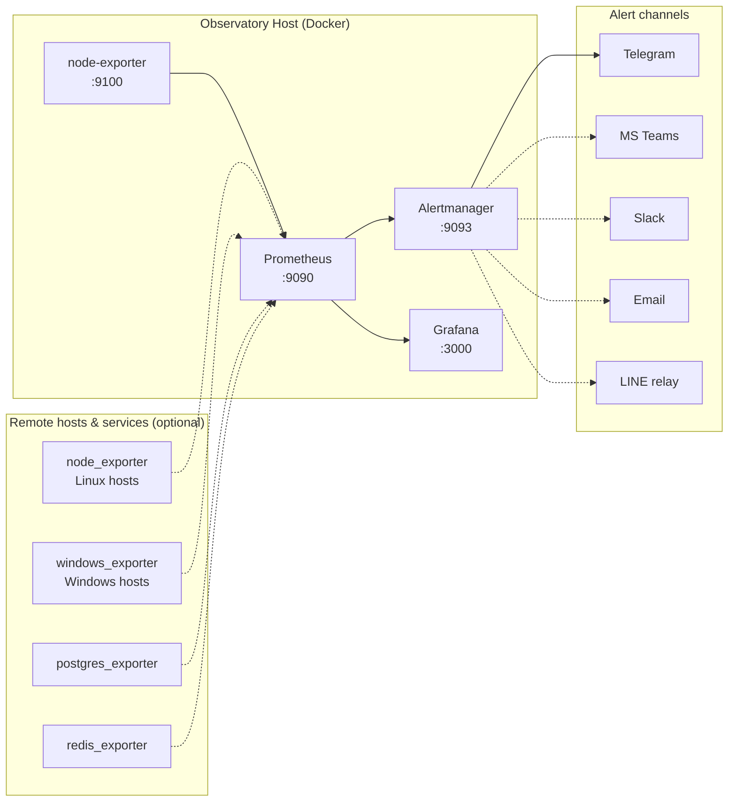

# 🛰️ Server Observatory Stack

[](https://github.com/kittaweek/server-observatory/actions/workflows/ci.yml)
[](https://github.com/kittaweek/server-observatory/actions/workflows/trivy.yml)
[](LICENSE)

A professional, minimal, fully-containerized monitoring stack built on
**Prometheus**, **Grafana**, and **Alertmanager**. Designed as a
production-grade template: opinionated defaults, env-driven config, and
a short path from `git clone` to a running dashboard.

## 🏗️ Architecture



Solid arrows are configured by default; dashed arrows are optional —
enable via `.env` + config edits described in [`docs/`](docs/).

## 🚀 Quick start

```bash
git clone https://github.com/kittaweek/server-observatory.git
cd server-observatory
cp .env.example .env
$EDITOR .env            # at minimum set GF_ADMIN_USER + GF_ADMIN_PASSWORD
make up                 # builds images + starts the stack
```

Open the UIs (all bound to `127.0.0.1` by default):

| Service | URL | Default credentials |
|---------|-------------------------|-----------------------|
| Grafana | <http://localhost:3000> | from `.env` |
| Prometheus | <http://localhost:9090> | — |
| Alertmanager | <http://localhost:9093> | — |
| node-exporter | <http://localhost:9100/metrics> | — |

To expose services on the network, copy
`docker-compose.override.yml.example` to `docker-compose.override.yml`
and edit the port bindings there.

## 🧰 Core features

- **Built-in security** — custom Dockerfiles patch upstream CVEs; all
  services run as non-root.
- **Dynamic config** — `${VAR}` substitution across Prometheus,
  Alertmanager, and Grafana provisioning.
- **Pre-provisioned** — Grafana datasource, Linux, and Windows dashboards
  ship out of the box.
- **Multi-channel alerts** — Telegram active by default; MS Teams, Slack,
  Email, and LINE ready to uncomment. See
  [`docs/alerting.md`](docs/alerting.md).
- **Resource limits** — CPU/memory caps applied to every service to
  prevent host exhaustion.
- **CI validation** — `docker compose config`, `promtool check config`,
  and `amtool check-config` run on every push.

## ⚙️ Configuration

All tunables live in `.env`. The file is heavily commented — open it
and you'll see sections for server identity, Prometheus timing, alert
thresholds, optional scrape targets, and each alert channel.

Only two variables are strictly required:

| Variable | Description |
|---------------------|------------------------------------|
| `GF_ADMIN_USER` | Grafana admin username |
| `GF_ADMIN_PASSWORD` | Grafana admin password (use a strong one) |

Everything else has safe defaults built into the entrypoint scripts.

## 📚 Documentation

- [`docs/add-node.md`](docs/add-node.md) — adding remote Linux hosts.
- [`docs/add-cloud-services.md`](docs/add-cloud-services.md) — adding
  service exporters (PostgreSQL, Redis, MySQL, …).
- [`docs/alerting.md`](docs/alerting.md) — channel-by-channel setup for
  Teams, Slack, Telegram, Email, LINE.
- [`docs/troubleshooting.md`](docs/troubleshooting.md) — common issues
  and how to diagnose them.

## 💾 Persistence & backup

Data is stored via bind-mounts under `./data/`:

- `./data/prometheus/` — time-series metric data
- `./data/grafana/` — dashboards, users, and plugin settings

The `./data/` tree is gitignored (only `.gitkeep` placeholders are
tracked). Back up with any standard tool, e.g. `tar czf backup.tgz data/`.

> [!CAUTION]
> `make purge CONFIRM=yes` **permanently deletes** everything under
> `./data/`. Plain `make down` stops services without touching data.

### Migrating from named volumes (legacy layout)

Older versions used Docker named volumes (`prometheus_data`,
`grafana_data`). To migrate existing data:

```bash
make down

docker run --rm -v prometheus_data:/from -v $(pwd)/data/prometheus:/to \
  alpine sh -c "cp -a /from/. /to/"
docker run --rm -v grafana_data:/from -v $(pwd)/data/grafana:/to \
  alpine sh -c "cp -a /from/. /to/"

git pull && make up
# once the stack is healthy:
docker volume rm prometheus_data grafana_data
```

## 🛠️ Maintenance

| Command | What it does |
|-----------------------|--------------|
| `make init` | Create `./data/` bind-mount folders |
| `make up` | Build images + start stack (runs `init` first) |
| `make down` | Stop services (data preserved) |
| `make restart` | Restart containers without rebuilding |
| `make logs` | Tail logs from all services |
| `make purge CONFIRM=yes` | Stop services + wipe `./data/` |
| `make lint` | Run pre-commit hooks |

## 🛡️ Security posture

- **Trivy scans** — image vulnerability scanning on every push/PR.
- **Gitleaks + detect-secrets** — block credentials from being
  committed (both as pre-commit hooks and in CI).
- **Rootless** — every service runs as a dedicated non-root user.
- **Localhost-only binding** — UIs are reachable only from the host
  until you opt in to external exposure.

If you find a security issue, see `CONTRIBUTING.md` for the responsible
disclosure process — please do not file a public issue.

## 🤝 Contributing

PRs welcome! See [`CONTRIBUTING.md`](CONTRIBUTING.md) for dev setup,
coding style, and the checklist we apply to every change.

## 📄 License

MIT — see [`LICENSE`](LICENSE).

---
*Created with ❤️ by the Devsiam Team.*
